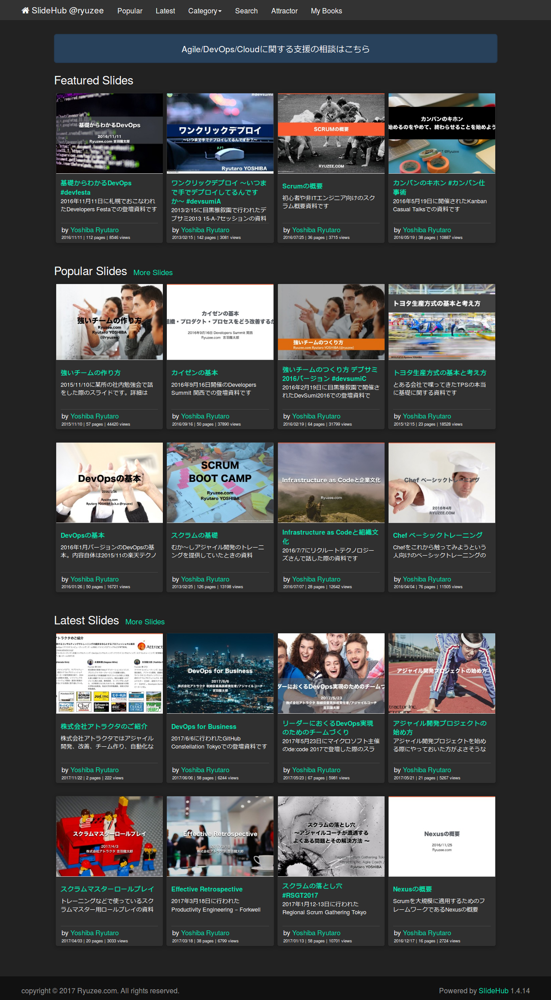

# SlideHub [](https://circleci.com/gh/ryuzee/SlideHub)  [](https://codeclimate.com/github/ryuzee/SlideHub/coverage)

**This is an open source slidesharing application with Azure / AWS.**

If you like or use this project, please provide feedback to author - Star it ★

The previous version of SlideHub was made with CakePHP. And this version is a successor of the previous version and is made with Ruby on Rails 5.


You can see other screenshot [here](docs/images/capture2.png).

## Features

- Uploading slides (pptx, pdf)
- Listing slides by category, user and so on
- Showing slide without Flash Player
- Showing slide vertically
- Storing all slides in Azure Blob Storage or Amazon S3. Thus terribly scalabale
- Searching slides
- i18n
- Responsive design
- Embedded player
- RSS
- Statistics
- Transcript
- API
- Admin Dashboard to overview statistics and edit slides

## Requirements

This application depends on following technologies.

* Docker (Azure Virtual Machine or Amazon EC2 is NOT required)
* MySQL or SQL Server or Azure SQL Database
* AWS or Azure
 * AWS: Amazon S3 / Amazon SQS
 * Azure: Blob Storage / Blob Queue

## Run the application on Azure Environment within 20 minutes

**If you want to get the application running on Azure without manual efforts, See [the instruction](docs/azure.md).**

## Preparing Infrastructure

### AWS

* Create two Amazon S3 buckets (cf. slidehub-slides, slidehub-images)
* Set CORS policy for bucket that will store the slide decks as follows

```
<?xml version="1.0" encoding="UTF-8"?>
<CORSConfiguration xmlns="http://s3.amazonaws.com/doc/2006-03-01/">
    <CORSRule>
        <AllowedOrigin>*</AllowedOrigin>
        <AllowedMethod>GET</AllowedMethod>
        <AllowedMethod>PUT</AllowedMethod>
        <AllowedMethod>POST</AllowedMethod>
        <AllowedMethod>HEAD</AllowedMethod>
        <AllowedHeader>*</AllowedHeader>
        <ExposeHeader>Access-Control-Allow-Origin</ExposeHeader>
        <MaxAgeSeconds>3000</MaxAgeSeconds>
    </CORSRule>
</CORSConfiguration>
```

* Create SQS queue (cf. slidehub-convert) and note the url.

### Azure

* Create two Azure Blob containers (cf. slidehub-slides, slidehub-images)
* Set CORS policy for the container that will store the slide decks as follows

```
require 'azure'

Azure.config.storage_account_name = 'YOUR_AZURE_STORAGE_ACCOUNT_NAME'
Azure.config.storage_access_key = 'YOUR_AZURE_STORAGE_ACCESS_KEY'

blob_service = Azure::Blob::BlobService.new
props = Azure::Service::StorageServiceProperties.new

props.logging = nil
props.hour_metrics = nil
props.minute_metrics = nil

# Create a rule
rule = Azure::Service::CorsRule.new
rule.allowed_headers = ["*"]
rule.allowed_methods = ["PUT", "GET", "HEAD", "POST", "OPTIONS"]
rule.allowed_origins = ["*"]
rule.exposed_headers = ["*"]
rule.max_age_in_seconds = 1800

props.cors.cors_rules = [rule]
blob_service.set_service_properties(props)

puts blob_service.get_service_properties.inspect
```

* Create Azure Blob Queue (cf. slidehub-convert) and note the name.

## Prepare Database Server

SlideHub can use MySQL and SQLServer (including Azure SQL Database).
There are several options to run a database server as follows.

* Launch virtual machine and install database software by your own
* Use Amazon Relational Database Services (RDS)
* Use Azure SQLDatabase

You need to get these variables as follows.

* Database URL
* Database user name
* Database password

And then, create database for the app. (Tables can be created by Rails migration)

### Retrieve Docker Image

```
docker pull ryuzee/slidehub:latest
```

## Run Application

The easiest way to run the app is to use Kubernetes, Amazon ECS(Elastic Container Service), Azure Web Apps on Linux or Azure Container Service.
However, if you want to run app by docker command, see follows.

```
$CONTAINER_ID=/usr/bin/docker run -d \
  --env OSS_REGION=$OSS_REGION \
  --env OSS_SQS_URL=$OSS_SQS_URL \
  --env OSS_BUCKET_NAME=$OSS_BUCKET_NAME \
  --env OSS_IMAGE_BUCKET_NAME=$OSS_IMAGE_BUCKET_NAME \
  --env OSS_USE_S3_STATIC_HOSTING=$OSS_USE_S3_STATIC_HOSTING \
  --env OSS_AWS_SECRET_KEY=$OSS_AWS_SECRET_KEY \
  --env OSS_AWS_ACCESS_ID=$OSS_AWS_ACCESS_ID \
  --env OSS_USE_AZURE=$OSS_USE_AZURE \
  --env OSS_AZURE_CONTAINER_NAME=$OSS_AZURE_CONTAINER_NAME \
  --env OSS_AZURE_IMAGE_CONTAINER_NAME=$OSS_AZURE_IMAGE_CONTAINER_NAME \
  --env OSS_AZURE_CDN_BASE_URL=$OSS_AZURE_CDN_BASE_URL \
  --env OSS_AZURE_QUEUE_NAME=$OSS_AZURE_QUEUE_NAME \
  --env OSS_AZURE_STORAGE_ACCESS_KEY=$OSS_AZURE_STORAGE_ACCESS_KEY \
  --env OSS_AZURE_STORAGE_ACCOUNT_NAME=$OSS_AZURE_STORAGE_ACCOUNT_NAME \
  --env OSS_SECRET_KEY_BASE=$OSS_SECRET_KEY_BASE \
  --env OSS_DB_NAME=$OSS_DB_NAME \
  --env OSS_DB_USERNAME=$OSS_DB_USERNAME \
  --env OSS_DB_PASSWORD=$OSS_DB_PASSWORD \
  --env OSS_DB_URL=$OSS_DB_URL \
  --env OSS_DB_PORT=$OSS_DB_PORT \
  --env OSS_DB_ENGINE=$OSS_DB_ENGINE \
  --env OSS_DB_USE_AZURE=$OSS_DB_USE_AZURE \
  --env OSS_SMTP_SERVER=$OSS_SMTP_SERVER \
  --env OSS_SMTP_PORT=$OSS_SMTP_PORT \
  --env OSS_SMTP_USERNAME=$OSS_SMTP_USERNAME \
  --env OSS_SMTP_PASSWORD=$OSS_SMTP_PASSWORD \
  --env OSS_SMTP_AUTH_METHOD=$OSS_SMTP_AUTH_METHOD \
  --env OSS_PRODUCTION_HOST=$OSS_PRODUCTION_HOST \
  --env OSS_ROOT_URL=$OSS_ROOT_URL \
  --env RAILS_LOG_TO_STDOUT=1 \
-P --name slidehub ryuzee/slidehub:latest`
```

Then prepare database as follows.

```
`docker exec $CONTAINER_ID bash -l -c 'bundle exec rake db:create RAILS_ENV=production'`
`docker exec $CONTAINER_ID bash -l -c 'bundle exec rake db:migrate RAILS_ENV=production'`
`docker exec $CONTAINER_ID bash -l -c 'bundle exec rake db:seed RAILS_ENV=production'
```

### Environmental Variables

The easiest way is to add these lines to `docker-compose.yml` when you are testing the app in your local environment.
If you are trying to use the app for production, set these variables via any Docker platform.

#### Cloud Settings (Azure)

```
OSS_USE_AZURE=[0|1] # If you want to use Azure, set 1
OSS_AZURE_CONTAINER_NAME=[Original file container name]
OSS_AZURE_IMAGE_CONTAINER_NAME=[Image container name]
OSS_AZURE_CDN_BASE_URL=[Set value if you are using CDN]
OSS_AZURE_QUEUE_NAME=[BLOB queue name]
OSS_AZURE_STORAGE_ACCESS_KEY=[Azure Storage Access Key]
OSS_AZURE_STORAGE_ACCOUNT_NAME=[Azure Storage Accout Name]
```

#### Cloud Settings (AWS)

```
OSS_BUCKET_NAME=[Original file bucket name]
OSS_IMAGE_BUCKET_NAME=[Image bucket name]
OSS_USE_S3_STATIC_HOSTING=[1|0]
OSS_REGION=[ap-northeast-1]
OSS_CDN_BASE_URL=[Set value if you are using CDN]
OSS_SQS_URL=[SQS URL]
OSS_AWS_ACCESS_ID=[Your AWS Access Key if you run app out of AWS]
OSS_AWS_SECRET_KEY=[Your AWS Secret Key if you run app out of AWS]
```

#### General Settings

```
# Rails
RAILS_ENV=[production|development]
RAILS_LOG_TO_STDOUT=[1] # set the variable if you want the standard output

# Mandatory
OSS_SECRET_KEY_BASE=[Your Secret Key Base]

# Mail settings
OSS_SMTP_SERVER=[Your SMTP server]
OSS_SMTP_PORT=[587]
OSS_SMTP_USERNAME=[Your SMTP account]
OSS_SMTP_PASSWORD=[Your SMTP password]
OSS_SMTP_AUTH_METHOD=plain
OSS_FROM_EMAIL=[Email address that will be used sender]

OSS_PRODUCTION_HOST=[hoge.example.com]
OSS_ROOT_URL=[http://your_root_url]

# For production (closely related to rails environment)
OSS_DB_NAME=[DB name for Prod] # Set openslideshare if using installer
OSS_DB_USERNAME=[DB Username for Prod] # Set root if using installer
OSS_DB_PASSWORD=[DB Password for Prod] # Set passw0rd if using installer
OSS_DB_URL=[DB URL for Prod] # Set localhost if using installer
OSS_DB_ENGINE=[DB Engine] # Default 'mysql2'. You can set 'mysql2' or 'sqlserver' (NOT 'mysql')
OSS_DB_PORT=[DB Port] # Default 3306
OSS_DB_USE_AZURE=[false|true] # If you are using Azure SQL Database, set true

# For development
OSS_DB_NAME_DEV=[DB name for Dev]
OSS_DB_USERNAME_DEV=[DB Username for Dev]
OSS_DB_PASSWORD_DEV=[DB Password for Dev]
OSS_DB_URL_DEV=[DB URL for Dev]
OSS_DB_ENGINE_DEV=[DB ENGINE for Dev]
OSS_DB_PORT_DEV=[DB PORT for Dev]
OSS_DB_USE_AZURE_DEV=[Use SQL Database for Dev]

# For test
OSS_DB_NAME_TEST=[DB name for Test]
OSS_DB_USERNAME_TEST=[DB Username for Test]
OSS_DB_PASSWORD_TEST=[DB Password for Test]
OSS_DB_URL_TEST=[DB URL for Test]
OSS_DB_ENGINE_TEST=[DB ENGINE for Test]
OSS_DB_PORT_TEST=[DB PORT for Test]
OSS_DB_USE_AZURE_TEST=[Use SQL Database for Test]
```

## For Development mode

### Requirements

- Docker (>= 17.06)
- docker-compose (>= 1.12.0)
- Ruby environment including bundler
- [bower](https://bower.io/)

After cloning the repository, you have to run `bower install` command to retrieve libraries.


### Build images and run the app for testing

You can use docker-compose for development. Try the commands as follows.
Before running the command, please set several environmental variables in your computer.
See docker-compose.yml

```
docker-compose build
docker-compose run app bash -l -c 'bundle exec rake db:create RAILS_ENV=development'
docker-compose run app bash -l -c 'bundle exec rake db:migrate RAILS_ENV=development'
docker-compose run app bash -l -c 'bundle exec rake db:seed RAILS_ENV=development'

docker-compose up -d
```

### Run tests

```
docker-compose run app bash -l -c 'bundle exec rake db:create RAILS_ENV=test'
docker-compose run app bash -l -c 'bundle exec rake db:test:prepare'
docker-compose run app bash -l -c 'bundle exec rspec'
```

If you want to run conversion process in the development environment, run the command as follows.

```
docker-compose run app bash -l -c 'bin/rails runner -e development "require \"./lib/slide_hub/batch\"; Batch.execute"'
```

## Register batch procedure to cron (If you do not use Docker)

* Handling uploaded slides (Mandatory)

```
*/1 * * * * /bin/bash -lc 'export PATH="/root/.rbenv/bin:$PATH" ; eval "$(rbenv init -)"; cd /opt/application/current ; bin/rails runner -e production "require \"./lib/slide_hub/batch\"; Batch.execute"'
```

* Generating sitemap and send it to Google and Bing (Optional)

```
0 3 * * * /bin/bash -lc 'source /etc/environment ; export PATH="$HOME/.rbenv/bin:$PATH" ; eval "$(rbenv init -)"; cd /opt/application/current ; bin/rake  sitemap:refresh RAILS_ENV=production'
```

## Login to the app

Default account is `admin@example.com` and the password is `passw0rd`.
*You need to change this account's password after the first login.*

## Run rubocop or other tools on Mac OS

When running some commands in your MacOS, you need to install some dependencies for installing gem files.

```
brew install freetds
brew install imagemagick@6
brew link --force imagemagick@6
brew install pkg-config
brew install libmagic
bundle
```

## Contributing

1. Fork the repository on Github
2. Create a named feature branch (like `add_component_x`)
3. Write your change
4. Write tests for your change (if applicable)
5. Run the tests, ensuring they all pass
6. Submit a Pull Request using Github

## License

MIT License

