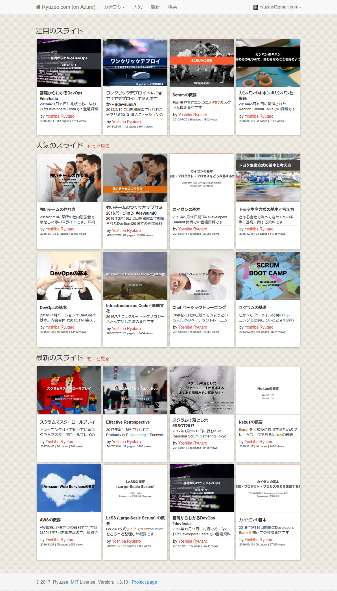

# SlideHub [](https://circleci.com/gh/ryuzee/SlideHub)  [](https://codeclimate.com/github/ryuzee/SlideHub)  [](https://codeclimate.com/github/ryuzee/SlideHub/coverage)

This is an open source slidesharing application with AWS or Azure.

The previous version of SlideHub was made with CakePHP. And this version is a successor of the previous version and is made with Ruby on Rails 4.


## Features

- Uploading slides (pptx, pdf)
- Listing slides by category, user and so on
- Showing slide without Flash Player
- Showing slide vertically
- Storing all slides in Amazon S3. Thus terribly scalabale
- Searching slides
- i18n
- Responsive design
- Embedded player
- RSS
- Statistics
- Transcript
- Admin Dashboard to overview statistics and edit slides

## Requirements

This application depends on following technologies.

* Ubuntu 12 or higher with OpenOffice, xpdf, unoconv and so on
* [Note] Application can be placed at any servers. (Amazon EC2 is NOT required.)
* AWS or Azure
 * AWS: Amazon S3 / Amazon SQS
 * Azure: Blob Storage / Blob Queue

## Preparing Infrastructure

### AWS

* Create two Amazon S3 buckets (cf. slidehub-slides, slidehub-images)
* Set CORS policy for bucket that will store the slide decks as follows

```
<?xml version="1.0" encoding="UTF-8"?>
<CORSConfiguration xmlns="http://s3.amazonaws.com/doc/2006-03-01/">
    <CORSRule>
        <AllowedOrigin>*</AllowedOrigin>
        <AllowedMethod>GET</AllowedMethod>
        <AllowedMethod>PUT</AllowedMethod>
        <AllowedMethod>POST</AllowedMethod>
        <AllowedMethod>HEAD</AllowedMethod>
        <AllowedHeader>*</AllowedHeader>
        <ExposeHeader>Access-Control-Allow-Origin</ExposeHeader>
        <MaxAgeSeconds>3000</MaxAgeSeconds>
    </CORSRule>
</CORSConfiguration>
```

* Create SQS queue (cf. slidehub-convert) and note the url.

### Azure

* Create two Azure Blob containers (cf. slidehub-slides, slidehub-images)
* Set CORS policy for the container that will store the slide decks as follows

```
require 'azure'

Azure.config.storage_account_name = 'YOUR_AZURE_STORAGE_ACCOUNT_NAME'
Azure.config.storage_access_key = 'YOUR_AZURE_STORAGE_ACCESS_KEY'

blob_service = Azure::Blob::BlobService.new
props = Azure::Service::StorageServiceProperties.new

props.logging = nil
props.hour_metrics = nil
props.minute_metrics = nil

# Create a rule
rule = Azure::Service::CorsRule.new
rule.allowed_headers = ["*"]
rule.allowed_methods = ["PUT", "GET", "HEAD", "POST", "OPTIONS"]
rule.allowed_origins = ["*"]
rule.exposed_headers = ["*"]
rule.max_age_in_seconds = 1800

props.cors.cors_rules = [rule]
blob_service.set_service_properties(props)

puts blob_service.get_service_properties.inspect
```

* Create Azure Blob Queue (cf. slidehub-convert) and note the name.

### General procedure

* Clone application on your server and copy files to /tmp/

```
git clone https://github.com/ryuzee/SlideHub
cp SlideHub/script/*.sh /tmp/
cd /tmp/
```

 * Edit develop.sh or staging.sh and then set Linux user name and other variables.
 * Then run the script you've just edited.
 * The script will install all required packages including Ruby environment, nginx, several tools and so on.
 * The script will also create the database on your server. However, if you want to use a database running on other server, you need to create a database by your own.

## Environment Variables

You also need to set several environmental variables as follows.
The easiest way is to add these lines to `/etc/environment` and restart your server.
The other option is to create `.env` file at application root directory. I recommend you to select the first option.

### Cloud Settings (Azure)

```
OSS_USE_AZURE=[0|1] # If you want to use Azure, set 1
OSS_AZURE_CONTAINER_NAME=[Original file container name]
OSS_AZURE_IMAGE_CONTAINER_NAME=[Image container name]
OSS_AZURE_CDN_BASE_URL=[Set value if you are using CDN]
OSS_AZURE_QUEUE_NAME=[BLOB queue name]
OSS_AZURE_STORAGE_ACCESS_KEY=[Azure Storage Access Key]
OSS_AZURE_STORAGE_ACCOUNT_NAME=[Azure Storage Accout Name]
```

### Cloud Settings (AWS)

```
OSS_BUCKET_NAME=[Original file bucket name]
OSS_IMAGE_BUCKET_NAME=[Image bucket name]
OSS_USE_S3_STATIC_HOSTING=[1|0]
OSS_REGION=[ap-northeast-1]
OSS_CDN_BASE_URL=[Set value if you are using CDN]
OSS_SQS_URL=[SQS URL]
OSS_AWS_ACCESS_ID=[Your AWS Access Key if you run app out of AWS]
OSS_AWS_SECRET_KEY=[Your AWS Secret Key if you run app out of AWS]
```

### General Settings

```
OSS_SMTP_SERVER=[Your SMTP server]
OSS_SMTP_PORT=[587]
OSS_SMTP_USERNAME=[Your SMTP account]
OSS_SMTP_PASSWORD=[Your SMTP password]
OSS_SMTP_AUTH_METHOD=plain
OSS_FROM_EMAIL=[Email address that will be used sender]
OSS_SECRET_KEY_BASE=[Your Secret Key Base]
OSS_PRODUCTION_HOST=[hoge.example.com]
OSS_ROOT_URL=[http://your_root_url]
OSS_DB_NAME_DEV=[DB name for Dev]
OSS_DB_USERNAME_DEV=[DB Username for Dev]
OSS_DB_PASSWORD_DEV=[DB Password for Dev]
OSS_DB_URL_DEV=[DB URL for Dev]
OSS_DB_NAME_TEST=[DB name for Test]
OSS_DB_USERNAME_TEST=[DB Username for Test]
OSS_DB_PASSWORD_TEST=[DB Password for Test]
OSS_DB_URL_TEST=[DB URL for Test]
OSS_DB_NAME=[DB name for Prod]
OSS_DB_USERNAME=[DB Username for Prod]
OSS_DB_PASSWORD=[DB Password for Prod]
OSS_DB_URL=[DB URL for Prod]
```

## Run the app

In the production environment, it's better to add the line below to /etc/rc.local

```
sudo -H -u ubuntu -s bash -c ‘source /etc/environment ; export PATH="$HOME/.rbenv/bin:$PATH" ; eval "$(rbenv init -)"; cd /opt/application/current ; bin/bundle exec rake unicorn:start'
```

In the development environment, you can run the app as follows.

```
rake start_dev
```

### Public Docker Image

You can use public Docker Image.

```
docker pull ryuzee/slidehub:latest
```

## Run application on Docker

After you build your own Docker image or pull public image pointed above, you can run the app on the Docker as follows.
Before run the app on the Docker, you need to create your own database on the other host to accumulate various data permanently.

This sample shows how to run app on AWS with Docker.

```
docker run -d \
  --env OSS_REGION=ap-northeast-1 \
  --env OSS_SQS_URL=https://sqs.ap-northeast-1.amazonaws.com/1234567890/your-sqs-job-name \
  --env OSS_BUCKET_NAME=your-bucket-name \
  --env OSS_IMAGE_BUCKET_NAME=your-image-bucket.example.com \
  --env OSS_USE_S3_STATIC_HOSTING=1 \
  --env OSS_AWS_SECRET_KEY=suSh19iTaiO0toroUMa1TamarAnG1Nza \
  --env OSS_AWS_ACCESS_ID=AKINATSUHAHIKARIMONO \
  --env OSS_SECRET_KEY_BASE=z3y1x4w1v5u9t26535abcdefghijklmnopqrstu12345 \
  --env OSS_DB_NAME=your-database-name \
  --env OSS_DB_USERNAME=your-database-user \
  --env OSS_DB_PASSWORD=your-database-password \
  --env OSS_DB_URL=your-database-host \
-P --name oss ryuzee/slidehub
```

## Register batch procedure to cron (If you do not use Docker)

* Handling uploaded slides (Mandatory)

```
*/1 * * * * /bin/bash -lc 'export PATH="$HOME/.rbenv/bin:$PATH" ; eval "$(rbenv init -)"; cd /opt/application/current ; bin/rails runner -e production Batch.execute'
```

* Generating sitemap and send it to Google and Bing (Optional)

```
0 3 * * * /bin/bash -lc 'source /etc/environment ; export PATH="$HOME/.rbenv/bin:$PATH" ; eval "$(rbenv init -)"; cd /opt/application/current ; bin/rake  sitemap:refresh RAILS_ENV=production'
```

## Contributing

1. Fork the repository on Github
2. Create a named feature branch (like `add_component_x`)
3. Write your change
4. Write tests for your change (if applicable)
5. Run the tests, ensuring they all pass
6. Submit a Pull Request using Github

## License

MIT License

